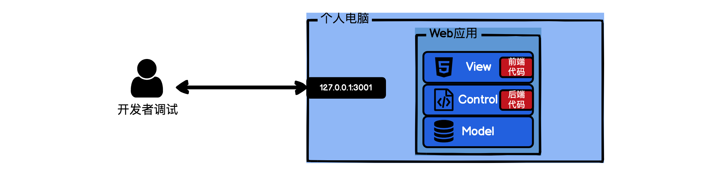
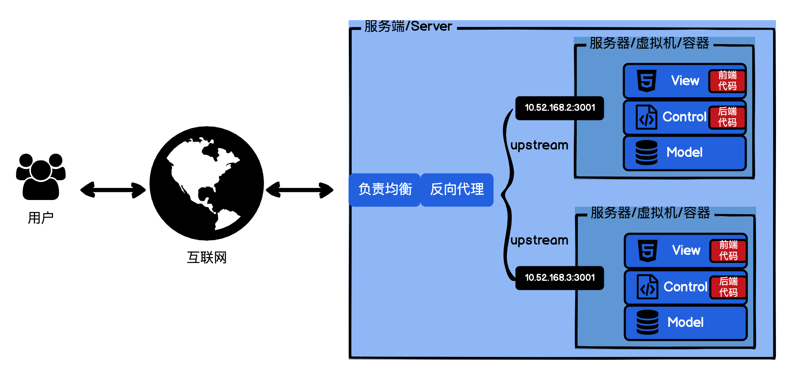
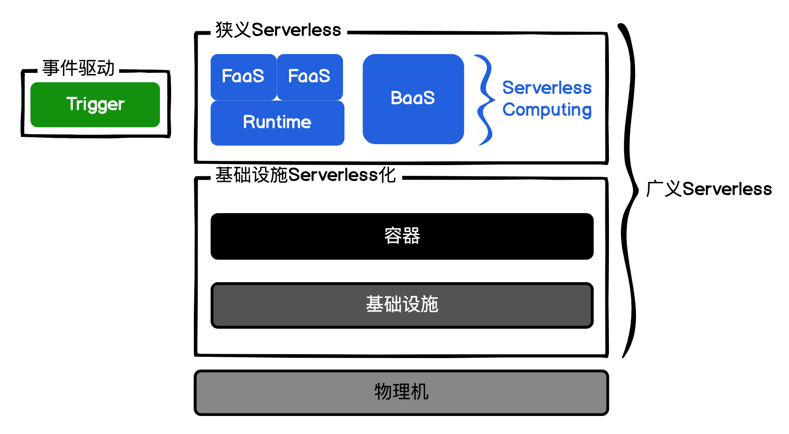

## 服务端
用 Web 应用经典的 MVC 架构来举例
代码在本地开发和调试时的数据流:

MVC架构的Web应用:

通常我部署运维一个应用时，由于要考虑容灾和容错，要保障异地多活，
因此需要部署 多个 Web 应用实例。每个 Web 应用实例跟我们在本地开发时是一样的，只是 IP 改为了私有网络 IP。
为了使多个 Web 应用实例在容灾和容错的场景下稳定地切换流量，我就需要负载均衡服务 和反向代理服务。
- 负载均衡服务，正如其名是负责将流量均衡地分配到各个应用机器上。
- 反向代理，常见的就是Nginx，它的任务是从请求中解析出域名信息，并将请求转发到上游 upstream 的监听地址。
### 服务端运维发展史，从 full 到 less
- 史前时代，Serverfull ： 研发和运维隔离
- 农耕时代，DevOps ：运维控制台 OpsConsole，将部署上线和日志抓取的工作由开发处理。 服务端运维的工作工具化了。
- 工业时代： 资源优化和扩缩容方案也可以利用性能监控 + 流量估算解决。 代码自动化发布的流水 线：代码扫描 - 测试 - 灰度验证 - 上线。

## serverless
1. 狭义 Serverless（最常见）= Serverless computing 架构 = FaaS 架构 = Trigger（事件驱动）+ FaaS（函数即服务）+ BaaS（后端即服务，持久化或第三方服务）= FaaS + BaaS
2. 广义 Serverless = 服务端免运维 = 具备 Serverless 特性的云服务

### FaaS (Serverless Computing)
- 通常函数的使用过程：它需要先从代码加载到内存，也就是实例化，然后被其 它函数调用时执行。
- FaaS 中：函数需要实例化，然后被触发器 Trigger 或者被其他的函数调用
- 二者最大的区别就是在 Runtime，也就是函数的上下文，函数执行时的语境。
- FaaS 的 Runtime 是预先设置好的，Runtime 里面加载的函数和资源都是云服务商提供的, FaaS 的 Runtime 是临时的，函数调用完 后，这个临时 Runtime 和函数一起销毁。所以 FaaS推荐无状态的函数。
### BaaS
- MVC 架构中的 Model 层，就需要我们用 BaaS 来解决。Model 层我们以 MySQL 为例， 后端服务最好是将 FaaS 操作的数据库的命令，封装成 HTTP 的 OpenAPI，提供给 FaaS 调用，自己控制这个 API 的请求频率以及限流降级。

## FaaS运行逻辑
### 传统运行"Hello world"

